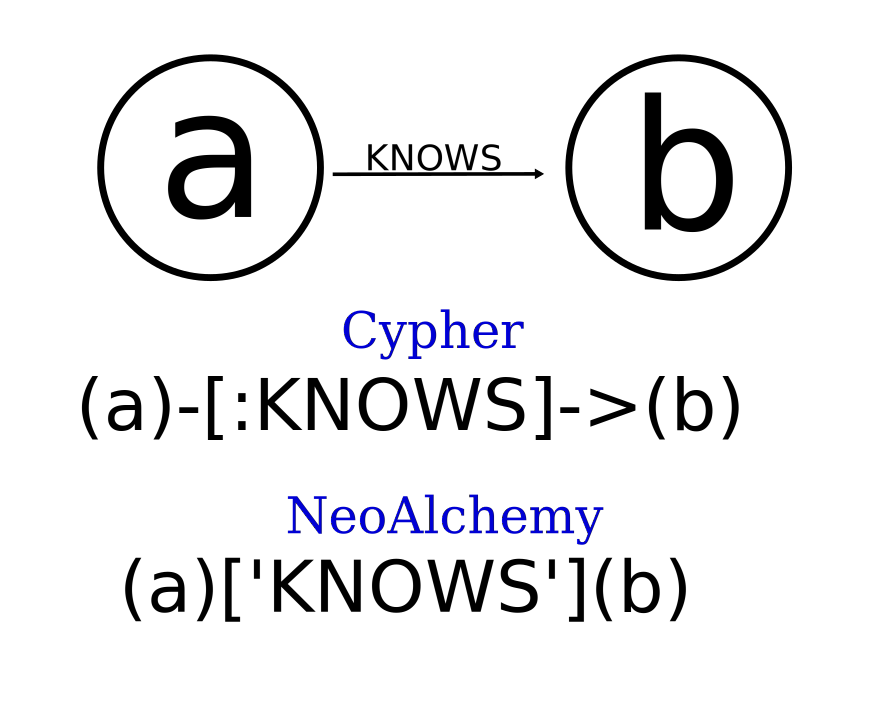

********************
The QueryBuilder API
********************

.. note::
    If you don't need the QueryBuilder API, feel free to skip straight to
    learning about the :doc:`schema-OGM`.

The QueryBuilder API allows you to express familiar Cypher queries using normal
Python objects and operators. To demonstrate it, we will use a simple
:py:class:`Node` like the ``user`` we defined in the previous section.
We'll call this one ``person`` and give it a few simple characteristics::

    from neoalchemy import Node, Property

    person = Node('Person',
        name=Property(indexed=True),
        age=Property(type=int),
        hair_color=Property()
    )

Don't forget to create the indexes and constraints you specified using
:py:meth:`graph.schema.add`::

    graph.schema.add(person)

.. warning::
    From `the Neo4J Docs`_:

      Indexes in Neo4j are *eventually available*. That means that when you
      first create an index the operation returns immediately. The index is
      *populating* in the background and so is not immediately available for
      querying. When the index has been fully populated it will eventually
      come *online*. That means that it is now ready to be used in queries.

======
Create
======

NeoAlchemy features :doc:`querybuilder-classes` which correspond to `familiar
Cypher verbs`_::

    from neoalchemy import Create

Let's start by constructing perhaps the simplest query possible::

    create = Create(person)

We can see the query this generates by printing it::

    >>> print(create)
    CREATE (node:`Person`)
        SET node.name = {node_name}, node.age = {node_age}, node.hair_color = {node_hair_color}

NeoAlchemy has automatically applied the ``Person`` label and created
parameters associated with each of the properties we defined. We can see
the current values for each parameter by inspecting the
:py:attr:`~neoalchemy.cypher.CypherVerb.params` dict::

    >>> create.params
    {'node_age': None, 'node_hair_color': None, 'node_name': None}

Each parameter is named according to its associated property and the variable
representing its associated node in the underlying Cypher. The default
parameter is ``node``. This can be freely changed to whatever you like::

    >>> person.var = 'n'
    >>> print(Create(person))
    CREATE (n:`Person`)
        SET n.name = {n_name}, n.age = {n_age}, n.hair_color = {n_hair_color}

Properties can be set individually on the Node::

    >>> person.name = 'Ali'
    >>> person.age = 30
    >>> person.hair_color = 'red'

Once you're satisfied, you can write it to the graph using
:py:class:`graph.query`::

    >>> graph.query(create, **create.params)

.. note::
    You can run arbitrary queries against the database using
    :py:class:`graph.query`.  It takes a string as its first argument and
    accepts parameters as keyword arguments. It returns a `Neo4J
    StatementResult`_. We'll learn more in depth about what :py:class:`Graph`
    can do a little later.

=====
Match
=====

Now that we've experimented a bit with writing to the database, let's take a
look at how to read data from it::

    from neoalchemy.cypher import Match

Match has a very similar interface to Create. For a simple use case, we get
almost identical results::

    >>> match = Match(Person)
    >>> print(match)
    MATCH (n:Person {hair_color: {hair_color_n}, name: {name_n}, age: {age_n}})

...but this isn't a very interesting ``MATCH`` statement. For one thing, it's
not a full query yet. In order to make this useful, at a minimum we need to
return something::

    >>> print(match.return_())
    MATCH (n:Person {hair_color: {hair_color_n}, name: {name_n}, age: {age_n}})
    RETURN *

.. note::
    Notice the function is **return_**, not **return**. The latter would cause
    a syntax error since ``return`` is a Python reserved word.

.. _return-signature:

------
Return
------

If you call :py:meth:`~neoalchemy.cypher.CypherVerb.return_` with no arguments,
the resulting query will ``RETURN *``, returning everything you have matched.
`For performance reasons`_, however, this is often not the best choice. There
are several ways to return only what you need instead of everything you've
touched.

============================  ==========================================  ========================
 What to Return                NeoAlchemy                                  Cypher Equivalent
============================  ==========================================  ========================
 One node                      ``return_('node')``                         ``RETURN node``
 Many nodes                    ``return_(['n', 'm'])``                     ``RETURN n, m``
 One property                  ``return_({'n': 'name'})``                  ``RETURN n.name``
 Many properties               ``return_({'n': ['x', 'y']})``              ``RETURN n.x, n.y``
 Nodes with properties         ``return_({'m': 'x', 'n': 'y'})``           ``RETURN m.x, n.y``
 Nodes with many properties    ``return_({'m': 'x', 'n': ['y', 'z']})``    ``RETURN m.x, n.y, n.z``
============================  ==========================================  ========================

.. note::
    The :py:meth:`~neoalchemy.cypher.CypherVerb.remove` and
    :py:meth:`~neoalchemy.cypher.CypherVerb.delete` methods work the same way.
    They correspond to Cypher's `REMOVE`_ and `DELETE`_.

.. _cypher-expression:

-----
Where
-----

As with :py:meth:`~neoalchemy.cypher.CypherVerb.set`, the
:py:meth:`~neoalchemy.cypher.CypherVerb.where` method can be used to set
parameters one at a time::

    match = Match(Person).where(Person.name=='Ali')

The first argument is a :py:class:`CypherExpression` object, which is
automatically created when you perform the corresponding Python comparison
using one of the NodeType's Properties.

=======================  =============================  =======================
 Comparison Type          NeoAlchemy CypherExpression    Cypher Equivalent
=======================  =============================  =======================
 Equal to                 ``Person.name == 'Ali'``       ``n.name = 'Ali'``
 Not equal to             ``Person.name != 'Ali'``       ``n.name <> 'Ali'``
 Greater than             ``Person.age > 29``            ``n.age > 29``
 Greater than or equal    ``Person.age >= 29``           ``n.age >= 29``
 Lesser than              ``Person.age < 29``            ``n.age < 29``
 Lesser than or equal     ``Person.age <= 29``           ``n.age <= 29``
=======================  =============================  =======================

.. _chaining:

========
Chaining
========

An important concept in NeoAlchemy is method chaining. Most methods ``return
self`` so you can call them like so::

    match = Match(Person).where(Person.name=='Ali').return_({'n': 'name'})

This makes for convenient and expressive one-liners. However, this also means
that state is easy to build up over time and as part of larger algorithms::

    match = Match(Person)
    # ... some code ...
    match.where(Person.age=age)
    # ... more code...
    match.return_(ret_params)

-------------
Relationships
-------------

Like `Cypher`_, NeoAlchemy "describes patterns in graphs visually using an
ascii-art syntax"::

    Create(Person, 'a')['KNOWS'](Person, 'b')

This creates exactly the relationship you would expect::

    >>> Person = NodeType('Person', Property('name'))
    >>> create = Create(Person, 'a')['KNOWS'](Person, 'b')
    >>> print(create)
    CREATE (a:Person {name: {name_a}})-[r1:KNOWS]->(b:Person {name: {name_b}})
    >>> create.params
    {'name_a': None, 'name_b': None}

This is another form of chaining! This not only means that relationship chains
can be arbitrarily long::

    Create(Person)['KNOWS'](Person)['KNOWS'](Person)['KNOWS'](Person)

It also means that you can write things like this::

    Match(Person).where(Person.name=='Ali')['KNOWS'](Person)
    # MATCH (n:Person)-[r1:KNOWS]->(n1:Person) WHERE n.name = {name_n}

================
Set Combinations
================

Not all Cypher queries are one line, and neither are all NeoAlchemy queries.
You can use Python's set operators to combine several NeoAlchemy objects into
multi-line queries before returning. The ``&`` (`set intersection`_) operator
is used for line-by-line cominbation::

    >>> match = (Match(Person).where(Person.name=='Ali')&
    ...          Match(Person, 'n', optional=True)['KNOWS'](Person, 'm')
    ...             .where(Person.name=='Frank', 'm'))
    >>> print(match.return_('r1'))
    MATCH (n:Person) WHERE n.name = {name_n}
    OPTIONAL MATCH (n:Person)-[r1:KNOWS]->(m:Person) WHERE m.name = {name_m}
    RETURN r1

The ``|`` (`set union`_) operator is used for ``UNION ALL``. To borrow an
example from the Cypher docs::

    >>> Movie = NodeType('Movie', Property('title'))
    >>> (Match(Person)['ACTED_IN'](Movie).return_({'n': 'name', 'n1': 'title'})|
    ...  Match(Person)['DIRECTED'](Movie).return_({'n': 'name', 'n1': 'title'}))
    >>> print(_)
    MATCH (n:Person {name: {name_n}})-[r1:ACTED_IN]->(n1:Movie {title: {title_n1}})
    RETURN n.name, n1.title
    UNION ALL
    MATCH (n:Person {name: {name_n}})-[r1:DIRECTED]->(n1:Movie {title: {title_n1}})
    RETURN n.name, n1.title

If you instead want ``UNION``, use the ``^`` (`exclusive or`_) operator.

.. note::
    ``UNION`` must be performed on queries with very similar result structures.
    You must take this into account when building your queries.

.. _the Neo4J Docs: http://neo4j.com/docs/developer-manual/current/#graphdb-neo4j-schema-indexes
.. _familiar Cypher verbs: https://neo4j.com/docs/developer-manual/current/cypher/clauses/
.. _Neo4J StatementResult: https://neo4j.com/docs/api/python-driver/current/#neo4j.v1.StatementResult
.. _For performance reasons: https://neo4j.com/docs/developer-manual/current/#query-tuning
.. _REMOVE: https://neo4j.com/docs/developer-manual/current/#query-remove
.. _DELETE: https://neo4j.com/docs/developer-manual/current/#query-delete
.. _Cypher: https://neo4j.com/developer/cypher-query-language/
.. _set intersection: https://docs.python.org/3/library/stdtypes.html#set.intersection
.. _set union: https://docs.python.org/3/library/stdtypes.html#set.union
.. _exclusive or: https://docs.python.org/3/library/stdtypes.html#set.symmetric_difference
